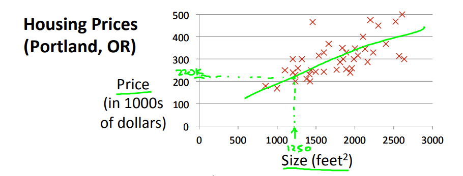
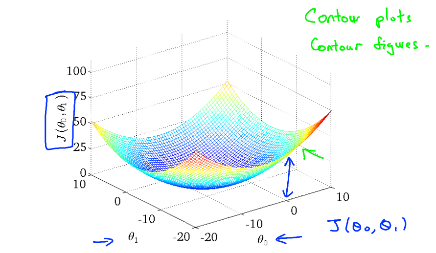

## 1 模型描述

用多元一阶方程来拟合训练集的数据，通过X的变换也可以用来表示N阶的多项式的函数，目标是对连续值的预测。

## 2 预测函数

输入X，给出机器学习算法的预测。

$$
h_\theta(x) = \theta(0) + \theta(1)x_1
$$



## 3 代价函数
对预测函数和数据集的评估，值大代表现有的预测函数不能很好的fit现有的数据集，机器学习过程中的目标是通过调整theta的值，最小化J(theta)值。

```
choose theta so that h is close to y for our training examples(minimize J)
```

$$
代价函数：J(\theta) =\frac{1}{2m}\sum_{i=1}^m (h_\theta(x^i) - y^i)^2
$$



## 4 梯度下降(grain)

在已有代价函数J情况下，找到能使J值最小的theta的一种算法。

```
给定一个初始化的theta，通过一定次数迭代，计算J对theta的偏导数，来调整theta的大小(增加或减小)，最终使J向最小值收敛。
```

这种算法假定，J(theta)在靠近最小值(局部最小值)的时候函数会更平缓(J对theta的偏导数趋紧于0)。如果偏导数为正，则说明函数的是递增的，则可以减小theta，反之可以增大theta。如果偏导数的值大，说明函数是陡峭的，离最小值(局部最小值)还有一定距离，调整的幅度大，反之调整幅度小。

### 4.1 算法执行过程

1、初始化$\theta$

2、选择学习参数$\alpha$和迭代次数

3、迭代执行$\theta_j = \theta_j - \alpha\frac{\partial J(\theta)}{\partial \theta_j}$


### 4.2 $\alpha$大小带来的影响

alpha过小：收敛速度慢，计算量大。

alpha过大：J可能不会收敛，甚至发散。


### 4.3 偏导数的计算


## 5 特征缩放

We can speed up gradient descent by having each of our input values in roughly the same range. This is because θ will descend quickly on small ranges and slowly on large ranges, and so will oscillate inefficiently down to the optimum when the variables are very uneven.

```
特征缩放：通过使X在相似的范围内，使梯度下降收敛的速度和精度都有提升。
```

### 5.1 特征缩放

$Xnorm =\frac{X-Xmin}{Xmax-Xmin} $

特征缩放会把输入数据都转换到[0 1]的范围

### 5.2 均值归一化

$Xnorm =\frac{X-\mu}{\sigma} $

mu是数据集X的平均值，sigma可以是Xmax-Xmin，也可以是数据集的标准差

## 6 多项式回归

Our hypothesis function need not be linear (a straight line) if that does not fit the data well.

For example, if our hypothesis function is $h_\theta(x) = \theta_0 + \theta_1 x_1$ then we can create additional features based on x_1x1, to get the quadratic function $h_\theta(x) = \theta_0 + \theta_1 x_1 + \theta_2 x_1^2$ or the cubic function $h_\theta(x) = \theta_0 + \theta_1 x_1 + \theta_2 x_1^2 + \theta_3 x_1^3$

```
在预测函数中加入多元多次项，让模型能更好的反映数据中的复杂关系。通过把多元多次项当作新的feature加入到训练集中，转化成线性回归，不会改变线性回归的原有的算法。
```


## 7 正规方程(Normal Equation)

```
通过训练集给定的X和y一次性的计算出theta，使J对每个theta的偏导数都为0。
```

$$
\theta = (X^T X)^{-1} X^T Y
$$

与梯度下降的对比：

|          梯度下降          |      正规方程      |
| :------------------------: | :----------------: |
| 需要选择$\alpha$和迭代次数 |       不需要       |
|    时间复杂度$O(kn^2)$     | 时间复杂度$O(n^3)$ |
|      适用于N大的情况       | 适用于N不大的情况  |

## 8 正则化

```
通过给J增加正则项来惩罚高次项，得到更简单的假设，解决过拟合的问题。
```
### 8.1 代价函数

$$
J(\theta) =\frac{1}{2m}(\sum_{i=1}^m (h_\theta(x^i) - y^i)^2 +  \lambda \sum_{j=1}^n \theta^2_j)
$$

### 8.2 偏导数

$$
\theta_0 = \theta_j - \alpha\frac{1}{m} \sum^m_{i=1} (h_\theta(x^{(i)}) - y^{(i)}) x^{(i)}_0      \\

\theta_j = \theta_j - \alpha[(\frac{1}{m} \sum^m_{i=1} (h_\theta(x^{(i)}) - y^{(i)}) x^{(i)}_j) + \frac{\lambda}{m} \theta_j]      \qquad j\in{1,2,...,n}\\
$$

### 8.3 正则化

$$
\theta = (X^T X + \lambda L)^{-1} X^T Y
$$

$$
where L = \begin{matrix}
        0 & 0 & 0 & 0\\
        0 & 1 & 0 & 0\\
        0 & 0 & \ddots & 0\\
        0 & 0 & 0 & 1\\
        \end{matrix}
$$


## 9 代码

```octave
代价函数计算:
function J = computeCost(X, y, theta)
%X = 100(samples) * 2(features); theta = 2(features) * 1; H = 100(hypothesis) * 1
H = X * theta;
%Y=100(samples) * 1(result); squared_errors = 100(squared_errors) * 1
squared_errors = (H - Y) .^ 2;
%J = real number
J = sum(squared_errors) / (2 * m);
```

```octave
梯度下降迭代:
function [theta, J_history] = gradientDescent(X, y, theta, alpha, num_iters)
for iter = 1:num_iters
    %(X * theta - y) = 100(samples) * 1;X' = 2(features) * 100(samples);
    %(X' * (X * theta - y) * alpha / m) = 2(features) * 1(sum of 100 samples);
    theta = theta - (X' * (X * theta - y) * alpha / m);
    % Save the cost J in every iteration    
    J_history(iter) = computeCost(X, y, theta);
end
```

```octave
均值归一化：
function [X_norm, mu, sigma] = featureNormalize(X)
X_norm = X;
mu = mean(X);%均值计算
sigma = std(X);% 标准差计算
X_norm = (X - mu) ./ sigma;
```

```octave
多项式生成：
function [X_poly] = polyFeatures(X, p)
X_poly = zeros(numel(X), p);
X_poly(:,1) = X;
for i = 2:p
  X_poly(:,i) = X .* X_poly(:,i-1);
end
```

```octave
正规方程：
function [theta] = normalEqn(X, y)
theta = zeros(size(X, 2), 1);
% X' * X = 2(featurs) * 2(features);pinv * (X' * X) = 2(featurs) * 2(features);
% theta = (2 * 2) * (2 * 100) * (100 * 1) = 2 * 1
theta = pinv(X' * X) * X' * y;
```

```octave
正则化下的代价函数和偏导数：
function [J, grad] = costFunctionReg(theta, X, y, lambda)
[J, grad] = costFunction(theta, X, y); %regularized regression is similar to basic, 
thetaExcludeZero = theta(2:size(theta));
% + (lambda / 2m) * sum(theta^2) exclude theta0
J = J + sum(thetaExcludeZero .^ 2) * lambda * 0.5 / m; 
% + theta * lambda / m exclude theta0
grad = grad + [0 ; thetaExcludeZero] * lambda / m ; 
```
