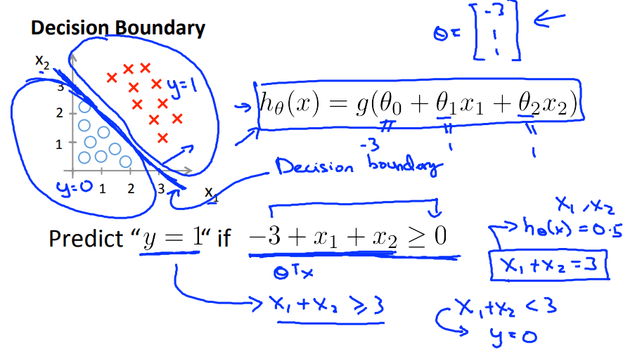

## 1 模型描述

解决离散值的预测问题。在线性回归的基础上，引入sigmoid函数来保证y值得预测在[0,1]之间。

## 2 预测函数

```
结合线性规划和sigmoid，利用sigmoid函数的特性来预测y-类型为1的概率，来做分类。
```

$$
h_\theta(x) = g(\theta^T x) \\
z = \theta^T x \\
g(z) = \frac{1}{1+e^{-z}}
$$


## 3 决策边界


```
决策边界分割了两类y=0和y=1的数据，由我们的h函数决定。
```

$$
h_θ(x)≥0.5→y=1 \\
h_θ(x)<0.5→y=0 \\
hθ(x)=g(θ^Tx)≥0.5whenθ^Tx≥0
$$




## 4 代价函数

```
线性回归采用预测值与真实值的方差作为代价函数，逻辑回归借助log函数来表示:
当y=1，h趋近于1，代价趋近于0；h趋近于0，代价趋近于无穷。y=0时反之。
```


### 4.1 代价函数

$$
Cost(h_\theta(x), y) = -y log(h_\theta(x)) - (1-y) log(1-h_\theta(x)) 	\\
J(\theta) = \frac{1}{m}\sum^m_{i=1} Cost(h_\theta(x), y)
$$


### 4.2 梯度下降

$$
偏导数(省略推导)：\frac{\partial J(\theta)}{\partial \theta_j} = (h_\theta(x) - y)x_j	\\
梯度下降迭代：\theta_j = \theta_j - \frac{\alpha}{m}\sum^m_{i=1}(h_\theta(x^{(i)}-y^{(i)})x_j^{(i)} 	\\
向量化实现:\theta = \theta - \frac{a}{m}X^T(g(X \theta) - y)
$$

### 4.3 优化算法

- Gradient descent

- Conjugate gradient

- BFGS

- L-BFGS

```
优点：不需要手动的选择参数alpha，通常比梯度下降要快；缺点：更复杂。
```
## 5多类型分类

### 5.1 一对多分类

```
思路:把一个多类型分解成K个独立的2元分类问题。在K个分类种取H值最大的作为最终分类。
```


## 

## 6 正则化

```
通过给J增加正则项来惩罚高次项，得到更简单的假设，解决过拟合的问题。
```
### 6.1 代价函数

$$
J(\theta) =
-\frac{1}{m}\sum_{i=1}^m [y^{(i)}log(h_\theta(x^{(i)})) + (1-y^{(i)})log(1-h_\theta(x^{(i)}))]
+
\frac{\lambda}{2m} \sum_{j=1}^n \theta^2_j
$$

### 6.2 偏导数

$$
\theta_0 = \theta_j - \alpha\frac{1}{m} \sum^m_{i=1} (h_\theta(x^{(i)}) - y^{(i)}) x^{(i)}_0      \\

\theta_j = \theta_j - \alpha[(\frac{1}{m} \sum^m_{i=1} (h_\theta(x^{(i)}) - y^{(i)}) x^{(i)}_j) + \frac{\lambda}{m} \theta_j]      \qquad j\in{1,2,...,n}\\
$$

## 9 代码

```octave
sigmoid函数:
function g = sigmoid(z)
g = 1.0 ./ (1.0 + exp(-z));
end
```

```octave
代价函数：
function [J, grad] = lrCostFunction(theta, X, y, lambda)

m = length(y); % number of training examples、

z = X * theta; % calc theta' * X
h = sigmoid(z); % calc hypothesis

thetaExcludeZero = theta(2:size(theta));

J1 = (y' * -log(h) + (1-y)' * -log(1 - h)) / m; % (sum(y * -log(h) + (1-y) * - log(1 - h))) * (1/m)
J2 = sum(thetaExcludeZero .^ 2) * lambda * 0.5 / m; % + (lambda / 2m) * sum(theta^2) exclude theta0
J = J1 + J2;

grad = (X' * (h - y) / m) + ([0 ; thetaExcludeZero] * lambda / m) ; % (a feature-number 
grad = grad(:);

end
```

```octave
优化算法在一对多分类种的应用：
function [all_theta] = oneVsAll(X, y, num_labels, lambda)

% Some useful variables
m = size(X, 1);
n = size(X, 2);

all_theta = zeros(num_labels, n + 1);

% Add ones to the X data matrix
X = [ones(m, 1) X];

for c = 1:num_labels

    % Set Initial theta
    initial_theta = zeros(n + 1, 1);
    
    % Set options for fminunc
    options = optimset('GradObj', 'on', 'MaxIter', 50);

    % Run fmincg to obtain the optimal theta
    % This function will return theta and the cost 
    [all_theta(c,:)] = ...
        fmincg (@(t)(lrCostFunction(t, X, (y == c), lambda)), ...
                initial_theta, options);
end 
end

```

```octave
一对多的预测函数：
function p = predictOneVsAll(all_theta, X)

% Add ones to the X data matrix
X = [ones(m, 1) X];

[maxP , p] = max(sigmoid(X * all_theta'), [], 2);
end
```


