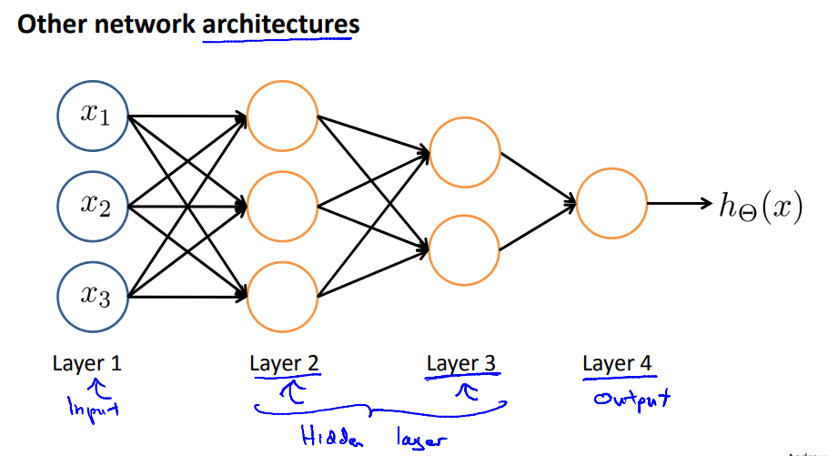
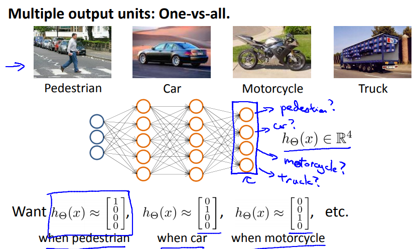

## 1 模型描述

模仿大脑的神经元时发明的，单个神经元收到其他神经元的输入信息后，按照一定的算法计算，向后续的神经元输出计算后的信息。



## 2 预测函数

### 2.1 预测函数

```
每个逻辑单元以上一层的输出为输入,结合线性函数和sigmoid函数,得出[0,1]范围内的输出值,层层传递
```

$$
z^{(j)} = \Theta^{(j-1)}a^{(j-1)}
\\
a(j)=g(z ^{(j)})
$$


### 2.2 表示复杂的逻辑运算
```
能表示线性函数不能处理的复杂逻辑运算,比如XOR.
```


### 2.3 多类型分类问题

```

```



## 4 代价函数


### 4.1 代价函数
```
神经网络的代价函数在逻辑回归的基础上,额外考虑了K维输出向量和L层的因素.整个代价函数如下.
```


### 4.2 偏导数计算

$$
首先定义\delta^{(l)}_j为l层中的节点j的误差。\\
对于输出层\delta^{(l)} = y - a^{(l)}.	\\
这种误差可以堪看成J对a偏导 * 下一层的误差.	\\
即\delta^{(l)} = \delta^{(l+1)} * \theta^{(3)} * g'(z^{(3)}) \\
\delta^{(l)}_j 恰好 =  \frac{\partial{J}}{\partial{z^{(l)}_j}} 	\\
\frac{\partial J(\theta)}{\partial \theta_j^{(l)}} = a^{(l)} * \delta^{(l+1)}(只考虑每层单元素的情况)	\\
对\delta累加:\Delta^{(l)}_{ij} = \frac{\partial J(\theta)}{\partial \theta_j^{(l)}}的累加\\
正则化:D^{(l)}_{ij} = \Delta^{(l)}_{ij} / m(j=0)\\
D^{(l)}_{ij} = \Delta^{(l)}_{ij} / m + \lambda\theta^{(l)}_{ij}(j=1)\\
$$

## 5 代码

```octave
神经网络的预测函数:
function p = predict(Theta1, Theta2, X)

% Useful values
m = size(X, 1);
num_labels = size(Theta2, 1);
p = zeros(size(X, 1), 1);

z2 = [ones(m, 1), X] * Theta1';%A(n+1) = g(A(n) * theta(n) ) ,A(n) should plus one colum
A2 = sigmoid(z2);
z3 = [ones(m, 1), A2] * Theta2';
A3 = sigmoid(z3);

[maxP , p] = max(A3, [], 2);

end
```

```octave
代价函数：
function [J grad] = nnCostFunction(nn_params, ...
                                   input_layer_size, ...
                                   hidden_layer_size, ...
                                   num_labels, ...
                                   X, y, lambda)
Theta1 = reshape(nn_params(1:hidden_layer_size * (input_layer_size + 1)), ...
                 hidden_layer_size, (input_layer_size + 1));
Theta2 = reshape(nn_params((1 + (hidden_layer_size * (input_layer_size + 1))):end), ...
                 num_labels, (hidden_layer_size + 1));
m = size(X, 1);
         
% You need to return the following variables correctly 
J = 0;
Theta1_grad = zeros(size(Theta1));
Theta2_grad = zeros(size(Theta2));

% init Y
I = eye(num_labels);
Y = zeros(m, num_labels);
for i = 1:m
  Y(i, :)= I(y(i), :);
end

% calc hypothesis
A1 = [ones(m, 1) X];
Z2 = A1 * Theta1';
A2 = [ones(size(Z2, 1), 1) sigmoid(Z2)];
Z3 = A2 * Theta2';
H = A3 = sigmoid(Z3);

% calc regularized cost (similar to Regularized Logisic Regression, ex3)
J1 = sum(sum((Y .* -log(H) + (1 - Y) .* -log(1 - H)), 2)) / m;
J2 = (sum(sum(Theta1(:, 2:end) .^ 2, 2)) + sum(sum(Theta2(:, 2:end) .^ 2, 2))) * lambda * 0.5 / m;
J = J1 + J2;

delta3 = A3 - Y;
delta2 = (delta3 * Theta2 .* sigmoidGradient([ones(size(Z2, 1), 1) Z2]))(:, 2:end);

Delta1 = delta2' * A1;
Delta2 = delta3' * A2;

Theta1_grad = Delta1./m + (lambda/m)*[zeros(size(Theta1,1), 1), Theta1(:, 2:end)];
Theta2_grad = Delta2./m + (lambda/m)*[zeros(size(Theta2,1), 1), Theta2(:, 2:end)];

% Unroll gradients
grad = [Theta1_grad(:) ; Theta2_grad(:)];

end
```

```octave
sigmoid求导:
function g = sigmoidGradient(z)

G = sigmoid(z);
g = G .* (1-G);

end
```

