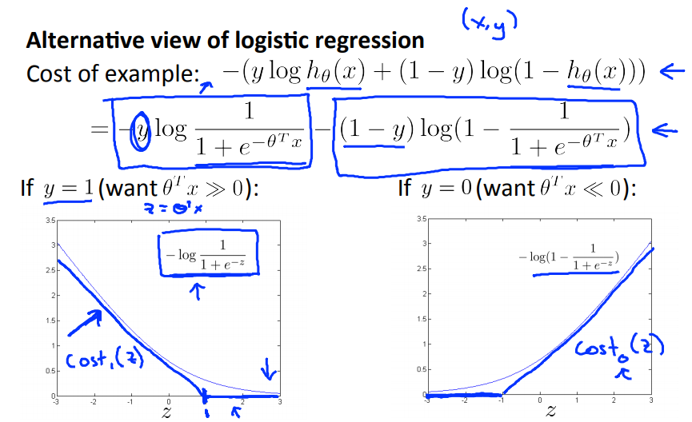
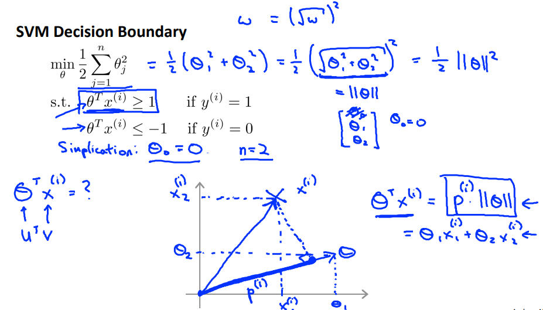
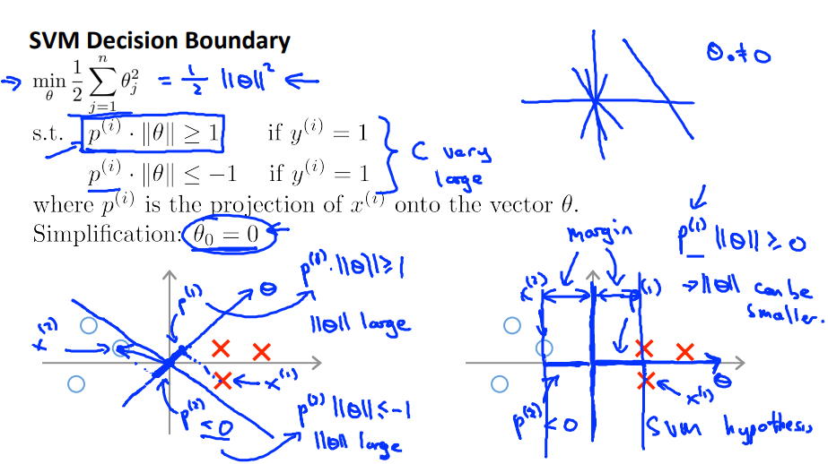
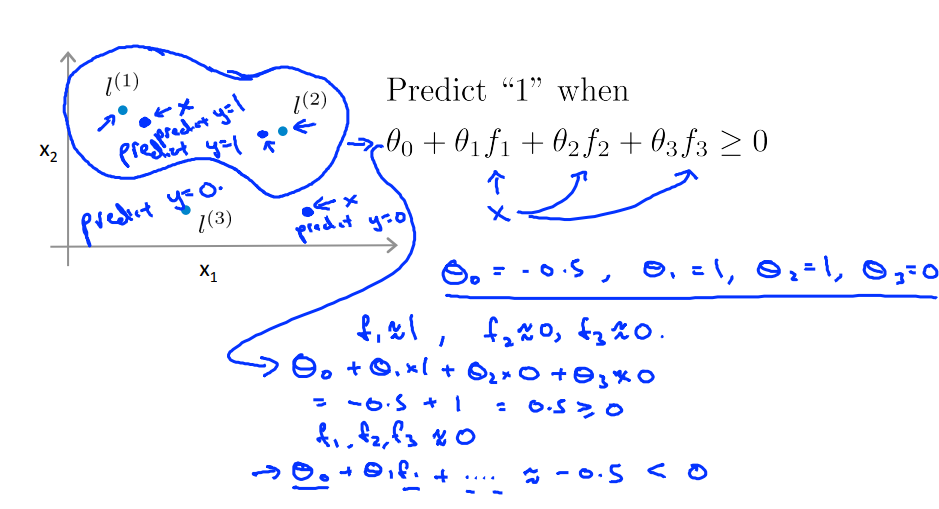

## 1 模型描述

可以当成是基于逻辑回归的延申，首先，对逻辑回归的代价函数进行调整。其次把大间距分类的理念引入，最后加入核函数的概念解决非线性决策边界的情况。

边界最大化，用正则项来做

### 1.1 从逻辑回归代价函数的演变



### 1.2 大间距分类器


$$
间距margin最大化即是\theta^2的最小化,原有的代价函数增加\theta^2项，通过权重C调整，
数学上的证明如下：
$$





### 1.3 核函数

结合高斯分布用相似度的概念作为新的特征，解决非线性决策边界的情况。

landmark的选择一般用所有的样本位置。



## 2 预测函数

### 2.1 预测函数

$$
h>0.5  ->  g(z) >0.5 -> z>0 ->\theta x>0 \\
predict \space if \space \theta^Tf>=0
$$
### 2.2 多类型分类问题

```
同逻辑回归，训练K个独立的模型，取H值最大的。
```

## 3 代价函数

```
和逻辑回归类似，不同在于cost1和cost0替代了原来的log函数。lambda变为了C。theta项跟m无关
```

$$
J(\theta) =
C\sum_{i=1}^m [y^{(i)}cost_1(\theta^Tx^{(i)}) + (1-y^{(i)})cost_0(\theta^Tx^{(i)})]
+
\frac{1}{2} \sum_{j=1}^n \theta^2_j
$$

$$
\
$$

## 4 高斯核函数

$$
f = kernel(x1,x2)	\\
f = exp(\frac{-||x-l||^2}{2\sigma^2})
$$

```
sigma越大越平滑(high bias low variance)
```

## 5 SVM与逻辑回归的选择

- n相比m很大，使用逻辑回归或者不带核函数的svm。
- n很小m中等，使用带 核函数的svm。
- n很小m很大，增加更多的特征，然后用逻辑回归或者不带核函数的svm。


```
总之svm因为把样本作为新的特征，所以不适合m值特别大的。同时如果n相对于m已经很大了，也没必要用svm
```
## 6 代码

```octave
高斯核函数:
function sim = gaussianKernel(x1, x2, sigma)

sim  = exp( -sum((x1 - x2) .^ 2) / (2 * sigma ^ 2) );

end
```

```octave
线性核函数:
function sim = linearKernel(x1, x2)

sim = x1' * x2;  % dot product

end
```
